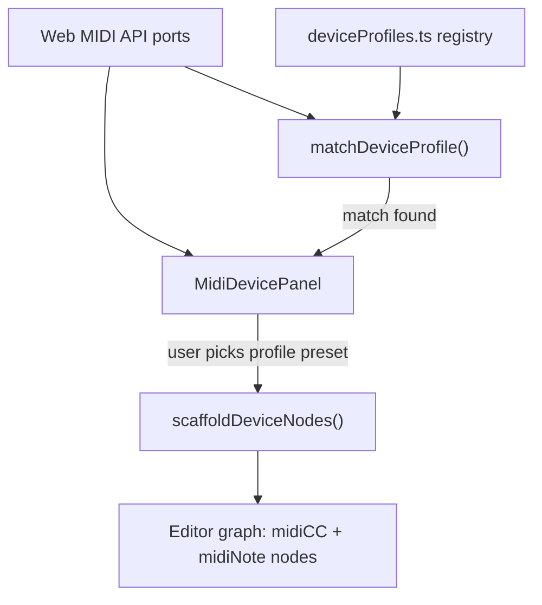

# MIDI Recognized Device Profiles -- DDJ-XP2 and Launch Control XL

## Current state

din-studio has **no recognized-device system**. The MIDI panel ([ui/editor/components/MidiDevicePanel.tsx](ui/editor/components/MidiDevicePanel.tsx)) lists raw Web MIDI ports and lets users learn/capture one CC or Note at a time. Nodes (`midiCC`, `midiNote`) store an `inputId` + `channel` + `cc`/`note` but no notion of "this control is Knob 3 on a Launch Control XL."

## Architecture -- new device profile layer




### Key files to create or edit

- **New** `ui/editor/deviceProfiles.ts` -- registry of recognized device profiles
- **Edit** [ui/editor/components/MidiDevicePanel.tsx](ui/editor/components/MidiDevicePanel.tsx) -- show matched profile, offer "Apply preset" action
- **Edit** [ui/editor/store.ts](ui/editor/store.ts) -- add `scaffoldDeviceNodes` action
- **Edit** [ui/editor/types.ts](ui/editor/types.ts) -- add `DeviceProfile` / `DeviceControl` types
- **New** feature doc `project/features/16_midi_recognized_devices.feature.md`
- **Edit** [project/SURFACE_MANIFEST.json](project/SURFACE_MANIFEST.json) -- add surface entry

---

## Device profile type

```typescript
interface DeviceControl {
  kind: 'cc' | 'note';
  channel: number;        // 1-based MIDI channel
  cc?: number;            // CC number (when kind === 'cc')
  note?: number;          // Note number (when kind === 'note')
  noteMax?: number;       // for note ranges (pads)
  label: string;          // human-readable, e.g. "Send A Knob 1"
  group: string;          // physical section, e.g. "sendA", "faders", "pads-bank-A"
  defaultNodeType: 'midiCC' | 'midiNote';
}

interface DeviceProfile {
  id: string;                          // e.g. "novation-launch-control-xl"
  name: string;                        // display name
  manufacturer: string;                // Web MIDI manufacturer string
  namePattern: string | RegExp;        // matched against MidiPortDescriptor.name
  controls: DeviceControl[];
  icon?: string;
  color?: string;
}
```

---

## Profile 1 -- Novation Launch Control XL

**Identity match:** `manufacturer` contains `"Novation"`, `name` contains `"Launch Control XL"`

The Launch Control XL exposes 24 knobs + 8 faders + 16 channel buttons + 4 directional buttons + 4 mode buttons on a single MIDI channel. Factory Template 1 (the default) uses the standard CC/Note layout below.

### Knobs (3 rows x 8) -- mapped to `midiCC` nodes


| Group  | Physical row | CC range  | Channel | Labels                |
| ------ | ------------ | --------- | ------- | --------------------- |
| Send A | Top row      | CC 13--20 | 1       | Send A 1 ... Send A 8 |
| Send B | Middle row   | CC 29--36 | 1       | Send B 1 ... Send B 8 |
| Pan    | Bottom row   | CC 49--56 | 1       | Pan 1 ... Pan 8       |


### Faders (1 row x 8) -- mapped to `midiCC` nodes


| Group  | CC range  | Channel | Labels              |
| ------ | --------- | ------- | ------------------- |
| Faders | CC 77--84 | 1       | Fader 1 ... Fader 8 |


### Channel buttons (2 rows x 8) -- mapped to `midiNote` nodes


| Group         | Physical row | Note range           | Channel | Labels                  |
| ------------- | ------------ | -------------------- | ------- | ----------------------- |
| Track Focus   | Top row      | Notes 41--44, 57--60 | 1       | Focus 1 ... Focus 8     |
| Track Control | Bottom row   | Notes 73--76, 89--92 | 1       | Control 1 ... Control 8 |


### Side buttons -- mapped to `midiCC` nodes


| Control    | CC     | Channel | Label      |
| ---------- | ------ | ------- | ---------- |
| Device     | CC 105 | 1       | Device     |
| Mute       | CC 106 | 1       | Mute       |
| Solo       | CC 107 | 1       | Solo       |
| Record Arm | CC 108 | 1       | Record Arm |


### Directional buttons -- mapped to `midiCC` nodes


| Control | CC     | Channel | Label |
| ------- | ------ | ------- | ----- |
| Up      | CC 104 | 9       | Up    |
| Down    | CC 105 | 9       | Down  |
| Left    | CC 106 | 9       | Left  |
| Right   | CC 107 | 9       | Right |


### Suggested DIN graph scaffold ("Apply Launch Control XL preset")

When the user applies the preset, create the following nodes in groups:

- **32 `midiCC` nodes** for the 24 knobs + 8 faders, auto-labeled by group
- **16 `midiNote` nodes** for the channel buttons (noteMode `single`)
- **8 `midiCC` nodes** for the side + directional buttons
- All nodes share the matched `inputId`
- Nodes arranged in a grid layout matching the physical controller rows

Total: **56 controls** pre-mapped.

---

## Profile 2 -- Pioneer DJ DDJ-XP2

**Identity match:** `manufacturer` contains `"Pioneer"`, `name` contains `"DDJ-XP2"`

The DDJ-XP2 is a pad-focused performance sub-controller. It exposes 32 velocity-sensitive RGB pads (left side = Ch 1, right side = Ch 2), transport/utility buttons, a rotary encoder, and a touch strip. In MIDI mode it sends Note On/Off for pads and buttons, CC for the strip and encoder.

### Pads (2 sides x 16 pads) -- mapped to `midiNote` nodes

Left side (Ch 1) and right side (Ch 2), each 4 rows x 4 columns:


| Group        | Row    | Note range   | Channel | Labels              |
| ------------ | ------ | ------------ | ------- | ------------------- |
| Pads L row 1 | Top    | Notes 0--3   | 1       | Pad L1 ... Pad L4   |
| Pads L row 2 |        | Notes 4--7   | 1       | Pad L5 ... Pad L8   |
| Pads L row 3 |        | Notes 8--11  | 1       | Pad L9 ... Pad L12  |
| Pads L row 4 | Bottom | Notes 12--15 | 1       | Pad L13 ... Pad L16 |
| Pads R row 1 | Top    | Notes 0--3   | 2       | Pad R1 ... Pad R4   |
| Pads R row 2 |        | Notes 4--7   | 2       | Pad R5 ... Pad R8   |
| Pads R row 3 |        | Notes 8--11  | 2       | Pad R9 ... Pad R12  |
| Pads R row 4 | Bottom | Notes 12--15 | 2       | Pad R13 ... Pad R16 |


### Touch strip -- mapped to `midiCC` node


| Control       | CC   | Channel | Label       |
| ------------- | ---- | ------- | ----------- |
| Touch Strip L | CC 9 | 1       | Strip Left  |
| Touch Strip R | CC 9 | 2       | Strip Right |


### Rotary encoder -- mapped to `midiCC` node


| Control        | CC    | Channel | Label  |
| -------------- | ----- | ------- | ------ |
| Browse Encoder | CC 64 | 1       | Browse |


### Transport buttons -- mapped to `midiNote` nodes


| Control                          | Note    | Channel | Label         |
| -------------------------------- | ------- | ------- | ------------- |
| Shift L                          | Note 63 | 1       | Shift Left    |
| Shift R                          | Note 63 | 2       | Shift Right   |
| 4 Beat Loop L                    | Note 16 | 1       | 4 Beat Loop L |
| 1/2X L                           | Note 17 | 1       | Half Loop L   |
| 2X L                             | Note 18 | 1       | Double Loop L |
| Quantize L                       | Note 19 | 1       | Quantize L    |
| (same pattern on Ch 2 for right) |         | 2       | ...           |


### Beat FX buttons -- mapped to `midiNote` nodes


| Control                  | Note    | Channel | Label          |
| ------------------------ | ------- | ------- | -------------- |
| Beat FX 1 L              | Note 48 | 1       | Beat FX 1 Left |
| Beat FX 2 L              | Note 49 | 1       | Beat FX 2 Left |
| Beat FX 3 L              | Note 50 | 1       | Beat FX 3 Left |
| (same on Ch 2 for right) |         | 2       | ...            |


### Suggested DIN graph scaffold ("Apply DDJ-XP2 preset")

When the user applies the preset, create the following nodes:

- **32 `midiNote` nodes** for pads (16 per side/channel), noteMode `single`, velocity-sensitive
- **2 `midiCC` nodes** for the touch strips (L/R)
- **1 `midiCC` node** for the browse encoder
- **~16 `midiNote` nodes** for transport + beat FX buttons
- All nodes labeled by physical position and bound to the matched `inputId`
- Nodes arranged in a grid mirroring the left/right physical layout

Total: **~51 controls** pre-mapped.

---

## Important caveat -- MIDI message list verification

The DDJ-XP2 CC/Note numbers above are derived from common Pioneer MIDI implementation patterns and third-party references. Pioneer publishes an official MIDI Message List PDF for the DDJ-XP2. **Before implementation, the exact Note and CC values MUST be verified** against the official Pioneer document or by connecting the hardware and using the existing MIDI Learn/Capture feature to record actual values. The registry should document the firmware version and template/mode assumed.

The Launch Control XL values are based on the official Novation Programmer's Reference Guide and correspond to **Factory Template 1** (template slot 8). Users using a custom user template (slots 0--7) may have different CC assignments -- the profile should note this.

---

## Implementation steps summary

1. Add `DeviceProfile` and `DeviceControl` types to [ui/editor/types.ts](ui/editor/types.ts)
2. Create [ui/editor/deviceProfiles.ts](ui/editor/deviceProfiles.ts) with the two profile definitions and a `matchDeviceProfile(port: MidiPortDescriptor): DeviceProfile | null` function
3. Update [ui/editor/components/MidiDevicePanel.tsx](ui/editor/components/MidiDevicePanel.tsx) to show a "recognized device" badge when a profile matches, plus an "Apply preset" button
4. Add `scaffoldDeviceNodes(profile, inputId)` to [ui/editor/store.ts](ui/editor/store.ts) -- bulk-creates and arranges the `midiCC` / `midiNote` nodes
5. Write feature doc and tests
6. Update [project/SURFACE_MANIFEST.json](project/SURFACE_MANIFEST.json) and [project/TEST_MATRIX.md](project/TEST_MATRIX.md)

